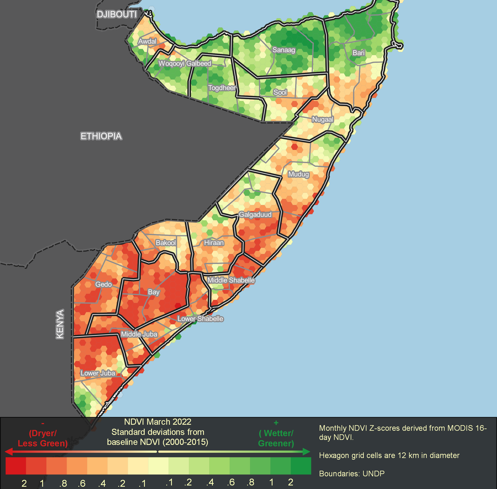
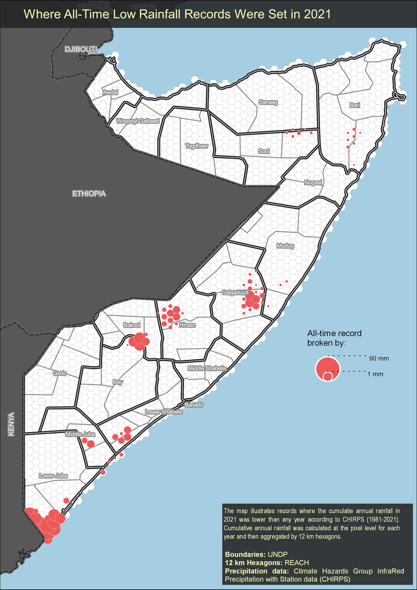

<!-- README.md is generated from README.Rmd. Please edit that file -->

```{r, include = FALSE}
knitr::opts_chunk$set(
  collapse = TRUE,
  comment = "#>",
  fig.path = "man/figures/README-",
  out.width = "100%"
)

```

# surveyGEER

<!-- badges: start -->
<!-- badges: end -->

This project/package contains ready to go code templates utilizing `rgee` and `tidyrgee` to extract remote sensing data for statistical analysis and mapping. `rgee` is the R API for Google Earth Engine (GEE)and includes all of the GEE functionality available in the code editor with a syntax that parallels both the JavaScript and the Python GEE APIs. `tidyrgee` is a package currently under rapid development that wraps the `rgee` package to create a syntax parallel to the `tidyverse`/`dplyr`. The goal of `tidyrgee` is to simplify a lot of of the more complicated processes and concepts that are currently  necessary when solving problems using the original GEE syntax-based coding frameworks.  To learn more about `tidyrgee` please visit the [tidyrgee github page](https://github.com/r-tidy-remote-sensing/tidyrgee) where you can find vignettes, use-case tutorials, etc.

The `surveyGEER` project package will provide templates using `tidyrgee`, eventually wrapping some of these processes into even larger functions specifically designed for REACH use-cases. The `tidyrgee` syntax  make remote sensing with GEE in R simple for any r/tidyverse user while `surveyGEER` specific wrappers will allow even beginner R-users to create standardized outputs.


## Installation

You can install the development version of surveyGEER like so:

```{r,eval= F}
devtools::install_github("impact-initiatives-geospatial/surveyGEER")
```

You can install the latest version of `tidyrgee` here:
```{r,eval= F}
devtools::install_github("r-tidy-remote-sensing/tidyrgee")
```


This package will hold templates and data-pipelines to extract remote sensing data using the `rgee` and new `tidyrgee` packages. Templates will be stored as vignettes in the package. I will provide one template in this readme to serve as an example for new users just visiting the page for the first time:


## Working examples

### Hex Maps

This annotated code below will show you how to extract the data to make maps similar to these hexagon maps below

**NDVI Standard Score Map**
```{r, echo=FALSE, fig.align='center', out.width='100%'}

```

**Precipitaiton Record Low Map**
```{r, echo=FALSE, fig.align='center', out.width='100%'}

```

Below is the code to extract the data relevant to your context. Once the data is extracted it can easily be mapped in any GIS software (even here in R). If you like how the above examples look, feel free to email zack.arno.ext@impact-initiatives.org for the QGIS templates. The output below can be put directly into the QGIS templates.

### Inputs

The code chunk below is the only place where the end-user needs to provide changes/modifications to the code to supply the correct inputs.

To perform the analysis for the maps you must have either:
a. an area of interest (AOI) spatial file, 
b. a pre-made grid over your AOI.


If you only have **a** , then the script will automatically generate **b** based on your desired hexagon diameter. You should put these file(s) into the `data` folder in this project working directory and provide the layer names as input in the code chunk below. If you do not provide either **a** or **b** a the boundary of Somalia will be used to creat the hexagon mesh. A default hexagon size of 15 km has been provided, but you should carefully select this based on what granularity would be most useful to visualize in your specific contexts. Additionally must set use the 3 letter (lower case) country code.  


```{r}
country_code <- NULL
AOI_layer_name <- NULL
AOI_grid_layer_name <- NULL
hex_diameter <- 15000 # 15 km set as default diameter for hexagon

surveyGEER:::aoi_or_grid_warning()

```

### Load libraries/Data

```{r}
library(surveyGEER)
library(rgee)
library(tidyrgee)
library(sf)

ee_Initialize()


modis_link <- "MODIS/006/MOD13Q1"
modisIC <- ee$ImageCollection(modis_link)


chirps_link <- "UCSB-CHG/CHIRPS/DAILY"
chirps <- ee$ImageCollection(chirps_link)

```
The below function will either load your pre-made grid or will generate a grid based on your `AOI_layer_name`, `country_code`, and `hexagon_diameter` inputs.

```{r example}


grid <- surveyGEER:::load_aoi_grid(aoi =AOI_layer_name,
                           grid = AOI_grid_layer_name,
                           hex_diameter = hex_diameter,
                           country_code = country_code
                           )

```

### Data Wrangling

MODIS NDVI should be transformed by multiplying the raster values by **0.0001**, below you can get a sense of what typical GEE/RGEE syntax looks like. For must R-users this looks a bit strange. `tidyrgee` which is shown in the following chunks simplifies a great deal of this for the end-user. Since raster math has not yet been added to to `tidyrgee` (coming soon), we will leave the the "classical" syntax below.

```{r}
modis_ndvi <- modisIC$
  select("NDVI")$
  map(
    ee_utils_pyfunc(
      function(x){x$
          multiply(0.0001)$
          copyProperties(x,x$propertyNames())
          }
    )
  )
```

Now it's time for some actual analysis. Here is where `tidyrgee` shines and vastly simplifies the code. To use the full power of `tidyrgee` you should convert the `imageCollection` to a `tidyee` class object with the simple function `as_tidyee`. Once this has been performed it is very easy to group, filter, composite(summarise) the `imageCollection`.

To calculate a standard score (Z-score) for monthly data we first need to create a baseline. Therefore we filter the `imageCollection` to 2000-2015. Then we group that data by month and summarise using the "mean" statistic. For every pixel this will calculate the "mean"  NDVI for each month in years 2000-2015 resulting in imageCollection of 12 images (1 per month). We then calculate the monthly baseline standard deviation ("sd") the same way.

```{r}


modis_ndvi_tidy <- as_tidyee(modis_ndvi)

monthly_mean_baseline <- modis_ndvi_tidy |> 
  filter(year %in% 2000:2015) |> 
  group_by(month) |> 
  summarise(stat="mean")

monthly_sd_baseline <- modis_ndvi_tidy |> 
  filter(year %in% 2000:2015) |> 
  group_by(month) |> 
  summarise(stat="sd")
```

Now we have two 12 image `ImageCollecitons` each with one band ("NDVI_mean","NDVI_sd"). We can join these bands using an `inner_join`. The common property that should be used for this band is "month" since we want the monthly mean and standard deviation for each month to be aligned

```{r}

monthly_baseline <- monthly_mean_baseline |> 
  inner_join(y= monthly_sd_baseline, by = "month")
 

```


Now that we have our baseline let's calculate the the average monthly NDVI for more recent years so that we can compare. We will first filter the `ImageCollection` to 2016-2022. Since we are working with the MODIS NDVI 16-day composite we have approximately 12 images per month. Therefore to simplify the process we should take the average NDVI value (per pixel) each month. To do this we can first `group_by(year,month)` and then call summarise. Remember if we just called `group_by(month)` it would reurn 12 images with 1 monthly average value for the entire time period of 2022-2012. By grouping by year and month we get the average monthly value for each year!
```{r}

ndvi_recent_monthly <- modis_ndvi_tidy |> 
  filter(year %in% c(2016:2022)) |> 
  group_by(year,month) |> 
  summarise(
    stat="mean"
  )
```


Since i want to eventually combine the baseline `NDVI_mean`, `NDVI_sd` with these new monthly means. I will rename the recent monthly band to `NDVI` so that we do not have duplicate band names. I have not yet written a `rename` method (will do soon), but do have a `select` method which is flexible enough to rename at the same time.
```{r}
ndvi_recent_renamed <- ndvi_recent_monthly |> 
  select(NDVI="NDVI_mean")

```
  

Now we are ready to join the `ImageCollection` bands into 1 `ImageCollection`. The following inner join returns 1 `ImageCollection` storing the monthly average `NDVI` values from 2016-2022 and the long-term (baseline) monthly average and standard deviations of `NDVI`

```{r}

ndvi_recent_and_baseline<- inner_join(x = ndvi_recent_renamed,
                                     y = monthly_baseline,
                                     by = "month")

```

Now we have all the necessary ingredients to calculate a standard score (Z-score). Below you get another chance to view some of trickier `rgee`/`GEE` syntax. This type of calculation has not yet been included in `tidyrgee` (coming soon), so we have to use this  syntax for the time being. `tidyrgee` is being developed to be inter-operable with `rgee`. Therefore we have developed simple functions such as `as_ee` to convert the `tidyee` class object back to `ee$ImageCollection` so that  any `ee$ImageCollection` methods from `rgee` will be available.


```{r}
ndvi_recent_baseline_imageCol <- ndvi_recent_and_baseline |> 
  as_ee()

ndvi_zscore<- ndvi_recent_baseline_imageCol$map(
  function(img){
    zscore<- img$expression(
      "float((NDVI-NDVI_mean)/(NDVI_stdDev))",
      opt_map= list(NDVI= img$select("NDVI"),
                    NDVI_mean= img$select("NDVI_mean"),
                    NDVI_stdDev= img$select("NDVI_stdDev")
      )
    )$rename("NDVI_z_score")
    img$select("NDVI","NDVI_mean")$addBands(zscore)
  }
  
) 

```


### Zonal stats per hexagon

