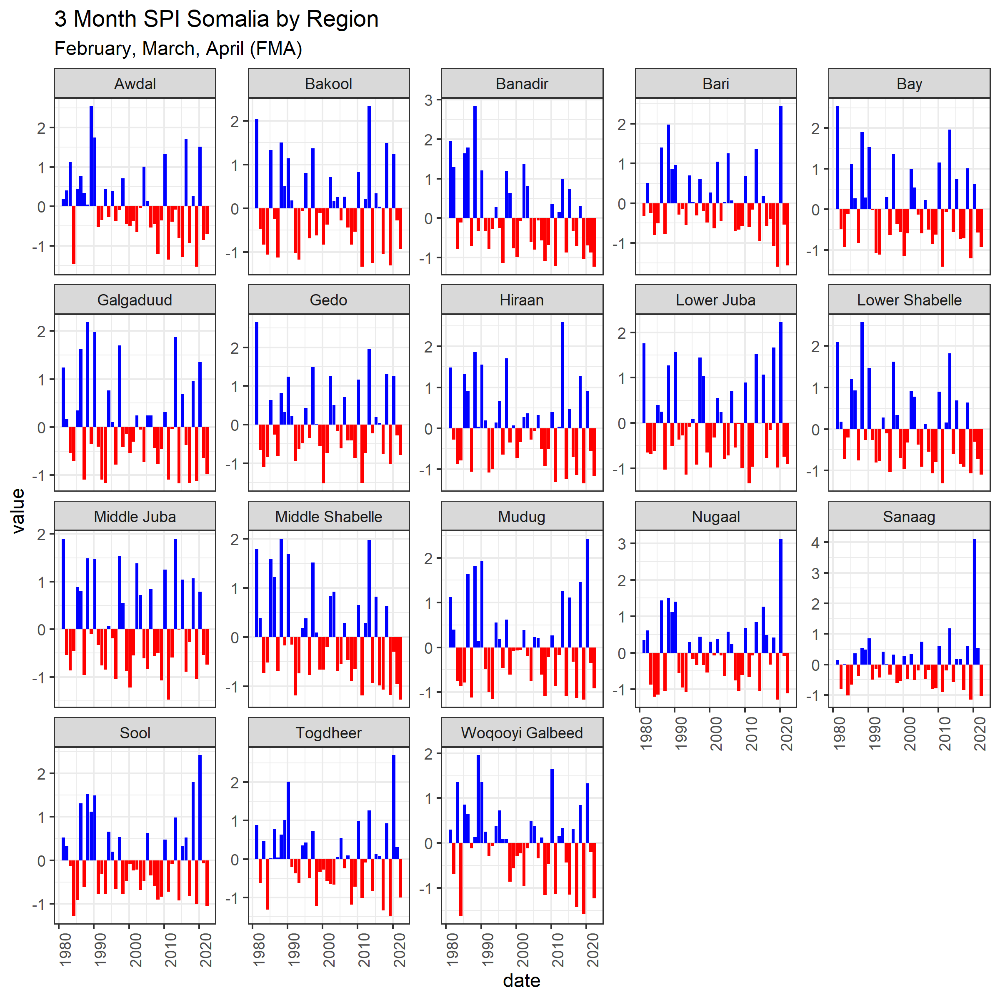

<!-- README.md is generated from README.Rmd. Please edit that file -->

# surveyGEER

<!-- badges: start -->
<!-- badges: end -->

This project/package contains ready to go code templates utilizing
`rgee` and `tidyrgee` to extract remote sensing data for statistical
analysis and mapping. `rgee` is the R API for Google Earth Engine
(GEE)and includes all of the GEE functionality available in the code
editor with a syntax that parallels both the JavaScript and the Python
GEE APIs. `tidyrgee` is a package currently under rapid development that
wraps the `rgee` package to create a syntax parallel to the
`tidyverse`/`dplyr`. The goal of `tidyrgee` is to simplify a lot of of
the more complicated processes and concepts that are currently necessary
when solving problems using the original GEE syntax-based coding
frameworks. To learn more about `tidyrgee` please visit the [tidyrgee
github page](https://github.com/r-tidy-remote-sensing/tidyrgee) where
you can find vignettes, use-case tutorials, etc.

The `surveyGEER` project package will provide templates using
`tidyrgee`, eventually wrapping some of these processes into even larger
functions specifically designed for REACH use-cases. The `tidyrgee`
syntax make remote sensing with GEE in R simple for any r/tidyverse user
while `surveyGEER` specific wrappers will allow even beginner R-users to
create standardized outputs.

## Installation

You can install the development version of surveyGEER like so:

``` r
devtools::install_github("impact-initiatives-geospatial/surveyGEER")
```

You can install the latest version of `tidyrgee` here:

``` r
devtools::install_github("r-tidy-remote-sensing/tidyrgee")
```

## Intro

This package will hold templates and data-pipelines to extract remote
sensing data using the `rgee` and new `tidyrgee` packages. Templates
will be stored as vignettes in the package. This aim of this **README**
is to provide a brief snap shot of some of the analysis, outputs, and
methods that will be stored and linked to in the templates. To perform
the analyses/run it is recommended that you work off the vignette
templates and store the `.rmd` file in the `filled_templates` folder
with a unique `prefix` for your work.

**Vignettes template/tutorial links**

-   Hexagon maps
    -   [NDVI Standard Score](insert_link_here)
    -   [Record low rainfall](instert_link_here)
-   [SPI](insert_link_here)
-   [Bivariate Climate Maps](insert_link_here)

## Working examples

Below are some of the customizeable outputs from the `surveyGEER`
package. Additionally, below we demonstrate some of the `tidyrgee`
syntax to create a few of these outputs. For comprehensive detailed
instructions on these outputs see the vignette links above.

### Hex Maps

**NDVI Standard Score Map**


**Precipitaiton Record Low Map**


**Regional SPI analyss**


Below is the code to extract the data relevant to your context. Once the
data is extracted it can easily be mapped in any GIS software (even here
in R). If you like how the above examples look, feel free to email
<zack.arno.ext@impact-initiatives.org> for the QGIS templates. The
output below can be put directly into the QGIS templates.

### Inputs

The code chunk below is the only place where the end-user needs to
provide changes/modifications to the code to supply the correct inputs.

To perform the analysis for the maps you must have either: a. an area of
interest (AOI) spatial file, b. a pre-made grid over your AOI.

If you only have **a** , then the script will automatically generate
**b** based on your desired hexagon diameter. You should put these
file(s) into the `data` folder in this project working directory and
provide the layer names as input in the code chunk below. If you do not
provide either **a** or **b** a the boundary of Somalia will be used to
creat the hexagon mesh. A default hexagon size of 15 km has been
provided, but you should carefully select this based on what granularity
would be most useful to visualize in your specific contexts.
Additionally must set use the 3 letter (lower case) country code.

``` r
country_code <- NULL
AOI_layer_name <- NULL
AOI_grid_layer_name <- NULL
hex_diameter <- 15000 # 15 km set as default diameter for hexagon

surveyGEER:::aoi_or_grid_warning()
```

### Load libraries/Data

``` r
library(surveyGEER)
library(rgee)
library(tidyrgee)
library(sf)
library(tidyverse)
devtools::load_all()

ee_Initialize()


modis_link <- "MODIS/006/MOD13Q1"
modisIC <- ee$ImageCollection(modis_link)


chirps_link <- "UCSB-CHG/CHIRPS/DAILY"
chirps <- ee$ImageCollection(chirps_link)
```

The below function will either load your pre-made grid or will generate
a grid based on your `AOI_layer_name`, `country_code`, and
`hexagon_diameter` inputs.

``` r
# debugonce(load_aoi_grid)
grid <- load_aoi_grid(aoi =AOI_layer_name,
                           grid = AOI_grid_layer_name,
                           hex_diameter = hex_diameter,
                           country_code = country_code
                           )
```

### Data Wrangling

MODIS NDVI should be transformed by multiplying the raster values by
**0.0001**, below you can get a sense of what typical GEE/RGEE syntax
looks like. For must R-users this looks a bit strange. `tidyrgee` which
is shown in the following chunks simplifies a great deal of this for the
end-user. Since raster math has not yet been added to to `tidyrgee`
(coming soon), we will leave the the “classical” syntax below.

``` r
modis_ndvi <- modisIC$
  select("NDVI")$
  map(
    ee_utils_pyfunc(
      function(x){x$
          multiply(0.0001)$
          copyProperties(x,x$propertyNames())
          }
    )
  )
```

Now it’s time for some actual analysis. Here is where `tidyrgee` shines
and vastly simplifies the code. To use the full power of `tidyrgee` you
should convert the `imageCollection` to a `tidyee` class object with the
simple function `as_tidyee`. Once this has been performed it is very
easy to group, filter, composite(summarise) the `imageCollection`.

To calculate a standard score (Z-score) for monthly data we first need
to create a baseline. Therefore we filter the `imageCollection` to
2000-2015. Then we group that data by month and `summarise`, calculating
a mean and standard deviation for each month. The result will store an
`imageCollection` of 12 images (1 per month). Each image will have 2
bands the `NDVI_mean` and `NDVI_sd`. Statistics are calculated at the
pixel-level for each image.

``` r

modis_ndvi_tidy <- as_tidyee(modis_ndvi)

monthly_baseline <- modis_ndvi_tidy |> 
  filter(year %in% 2000:2015) |> 
  group_by(month) |> 
  summarise(stat=list("mean","sd"))
```

Now that we have our baseline let’s calculate the the average monthly
NDVI for more recent years so that we can compare. We will first filter
the `ImageCollection` to 2016-2022. Since we are working with the MODIS
NDVI 16-day composite we have approximately 2 images per month.
Therefore to simplify the process we should take the average NDVI value
(per pixel) each month. To do this we can first `group_by(year,month)`
and then call `summarise`. Remember if we just called `group_by(month)`
it would return 12 images with 1 monthly average value for the entire
time period of 2022-2012. By grouping by year and month we get the
average monthly value for each year!

``` r
ndvi_recent_monthly <- modis_ndvi_tidy |> 
  filter(year %in% c(2016:2022)) |> 
  group_by(year,month) |> 
  summarise(
    stat="mean"
  )
```

Since I know I want to eventually combine the baseline stats calculated
previously (`NDVI_mean`, `NDVI_sd`) with these new monthly means ,I need
to rename the band produced in this new summary. By default the
band_name is written as: `original band names` + `_` + `stat`. To avoid
duplicate band names later when joining I will rename the band names in
`ndvi_recent_monthly` from `NDVI_mean` just to `NDVI`. We can do this
with the select method just by supplying a name (will be adding a pure
`rename` function soon).

``` r
ndvi_recent_renamed <- ndvi_recent_monthly |> 
  select(NDVI="NDVI_mean")
```

Now we are ready to join the `ImageCollection` bands into 1
`ImageCollection`. The following inner join returns 1 `ImageCollection`
storing the monthly average `NDVI` values from 2016-2022 and the
long-term (baseline) monthly average and standard deviations of `NDVI`

``` r
ndvi_recent_and_baseline<- inner_join(x = ndvi_recent_renamed,
                                     y = monthly_baseline,
                                     by = "month")
```

Now we have all the necessary ingredients to calculate a standard score
(Z-score). Below you get another opportunity to view some of trickier
`rgee`/`GEE` syntax. This `expression` functionality has not yet been
adapted/wrapped in `tidyrgee` (coming soon) so using the `rgee` syntax
is still our only option. This is why a basic understanding of `GEE` and
`rgee` is still quite handy.

`rgee` cannot handle `tidyee` classes, therefore we need to convert the
object back to the `ee$ImageCollection` format `rgee` was written for.
Luckily `tidyrgee` is being developed to be inter-operable with `rgee`
and provides simple helper functions such as `as_ee` for this type of
conversion. After running `as_ee` we have access to all the methods
available in `rgee/GEE`.

``` r
ndvi_recent_baseline_imageCol <- ndvi_recent_and_baseline |> 
  as_ee()

ndvi_zscore<- ndvi_recent_baseline_imageCol$map(
  function(img){
    zscore<- img$expression(
      "float((NDVI-NDVI_mean)/(NDVI_stdDev))",
      opt_map= list(NDVI= img$select("NDVI"),
                    NDVI_mean= img$select("NDVI_mean"),
                    NDVI_stdDev= img$select("NDVI_stdDev")
      )
    )$rename("NDVI_z_score")
    img$select("NDVI","NDVI_mean")$addBands(zscore)
  }
  
) 
```

### Zonal stats per hexagon

`ndvi_zscore` is now an `ee$ImageCollection` class object. We can easily
convert back to `tidyee` with `as_tidyee()`. However, the zonal
statistics tool `ee_extract_tidy()` works on both on
`ee$ImageCollection` and `tidyee`. Just for ease of filtering and
selecting let’s convert it back to `tidyee`

Zonal statistics are heavery computationally expensive calculations. For
example I ran the stats to calculate the median value of all 3 bands for
every hexagon grid () for every month in the current composite
collection (76 images) and it to 160 minutes. Therefore, let’s do some
pre-processing so we only extract exactly what we need:

-   we are only really interested in the `z_score` band so let’s select
    that
-   we are only really interested 2021 onwards so let’s filter the
    object to everything from 2021 onwards

``` r
ndvi_z <- as_tidyee(ndvi_zscore)

#
ndvi_z_pre_processed <- ndvi_z |> 
  filter(year>=2021) |> 
  select("NDVI_z_score")
```

``` r
leaflet::leaflet(grid ) |>
  leaflet::addTiles() |> 
  leaflet::addPolygons()
```

You should run `?ee_extract_tidy` to check all the optional parameters.
It is important to include the scale of the image/imageCollection. If
you are using a large `featureCollection` or sf spatial object you will
need to adjust the `via` argument. I usually have best luck with
`via="drive"`. The amount of time to perform an extraction can vary due
to computations in the cloud, but as a reference point this example
(3509 15 km diameter grids) took 232 seconds. If your grid covers the
bounding box of your study area, it is probably a good idea to clip it
to the area of study polygon to avoid unnecessary computations and save
time.

``` r
# 9591.06 /60

# as_tidyee(ndvi_zscore)

system.time(
  grid_with_ndvi <- ndvi_z_pre_processed |> 
  ee_extract_tidy(y = grid,stat = "mean",scale = 250,via = "drive")
)
```

Now let’s prep the chirps data for extraction. First convert it to
tidyee format so we can leverage the easy filter/summarise methods

``` r
# get cummulative rainfall for each year on record
chirps_tidy <- as_tidyee(chirps)
```

Let’s take the entire daily record from 1981-current and extract the
yearly precipitation for each year at the pixel level. Since each pixel
represents daily rainfall (mm) we can just group the images by year and
sum them to get annual rainfall.

``` r
chirps_annual_precip <- chirps_tidy |> 
  select("precipitation") |> 
  group_by(year) |> 
  summarise(
    stat="sum"
  )
```

Next let’s again use the `ee_extract_tidy` function to extract these
yearly values. Conceptually we are using our grid to perform zonal
statistics on each image (1 per year). the output is a long format tidy
data frame with all the median yearly values (1 per hex per year). This
took about:

``` r
system.time(
yearly_rainfall_hex <-   chirps_annual_precip |> 
  ee_extract_tidy(y = grid,
                  stat = "median",
                  scale = 5500,
                  via = "drive")
)
```

``` r
yearly_rainfall_hex_1981_2021<- yearly_rainfall_hex |> 
  filter(lubridate::year(date)!=2022) |> 
  dplyr::group_by(uid) |> 
  dplyr::mutate(
    record_low = value==min(value),
    record_high= value==max(value)
  ) 

record_lows_2021 <- yearly_rainfall_hex |> 
  filter(record_low) |> 
  filter(date=="2021-01-01")

record_highs_2021 <- yearly_rainfall_hex |> 
  filter(record_high) |> 
  filter(date=="2021-01-01")


record_lows_2021 <- yearly_rainfall_hex |> 
  # filter out 2022 since it is not yet  complete
  filter(lubridate::year(date)!=2022) |> 
  # group by grid uid
  dplyr::group_by(uid) |>
  # grab two lowest annual records
  dplyr::slice_min(n = 2,order_by = value) |> 
  # calculate the difference in the two lowest annual values 
  # and specify which is the lowest with T/F
  mutate(
    lower_by = max(value)- min(value),
    record_low = value==min(value)
  ) |> 
  ungroup() |> 
  # filter just the lowest record
  filter(record_low) |> 
  mutate(
    date= lubridate::year(date)
  ) |> 
  #now filter just to year of interest 2021 to 
  # see where that year had all time lowest annual value on record
  filter(date==2021)
```

``` r
# join record lows to original hex object by "uid" to make spatial again
# then filter out any hex that does not have record breaking value
# change remaining hex's to centroid points so that we can map as propotional bubbles.
record_low_centroids<- grid |> 
  dplyr::left_join(record_lows_2021) |> 
  filter(record_low==T) |> 
  st_centroid() 
```
